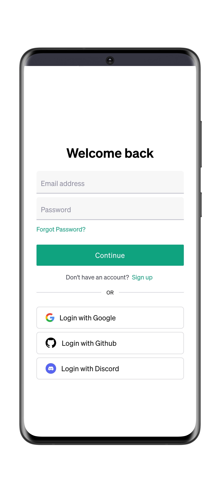
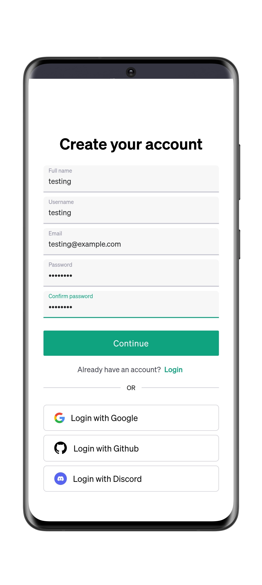
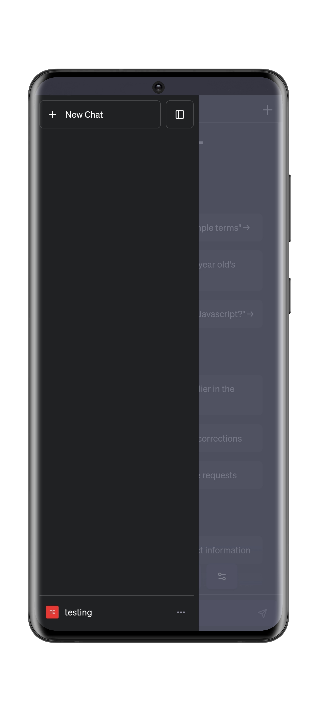

<h1 align="center">LibreChat Instance App</h1>

*******


## About

This app is a webview for [LibreChat](https://github.com/danny-avila/LibreChat) instance Android independent app, this project is forked from [ChatGPT-android-app](https://github.com/matthaigh27/ChatGPT-android-app). ~~Default webpage of this app has been set to LibreChat's GitHub Page~~. This app is optimized for LibreChat's function which is not in original project. For example, Social Login Oauth login support is added to this build.

Note: Now the default webpage of the latest example [Build](https://github.com/goodair220917/LibreChat-Android-App/releases/tag/demo) has been set to LibreChat's official demo.

## Screenshots

<div>


</div>


## Optimization for LibreChat Web Instance

* Social Login redirects will be done in same webview, no longer jumping to browser

* File uploads support was added to app for the import of presets

<h3>Requirements</h3>

* Android Studio
## Build


   * <h4 style="font-weight: normal;">1. Clone or download the repository.
```bash
git clone https://github.com/goodair220917/LibreChat-Android-App.git
```
* <h4 style="font-weight: normal;">2. Edit the MainActivity.kt file in /path/to/repo/app/src/main/java/com/librechat/app/ replace the default LibreChat Github repo url with your own LibreChat Instance url.</h4>
* <h4 style="font-weight: normal;">3. Open Android Studio and open the repository folder, then click the Build button to build the app (app-debug.apk file).
 </h4>


## Credits

 * <h3><u>LibreChat</u> </h3>
    <a href="https://github.com/danny-avila/LibreChat"></a>
    
    <h3>All-In-One AI Conversations with LibreChat</h3>
    <hr>
    <h4>Open-Source ChatGPT Clone supports famous AI providers.</h4>
    <h6>(LibreChat Project, go check out!!!!)</h6>

 * <h3><u>ChatGPT-android-app</u></h3>
    <a href="https://github.com/matthaigh27/ChatGPT-android-app"></a>
   <h4>This (unofficial) app acts as a webview wrapper for <a href="https://chat.openai.com">chat.openai.com</a></h4>
   <h6>(The original project of this project!)</h6>

